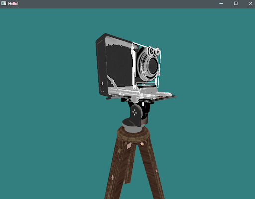
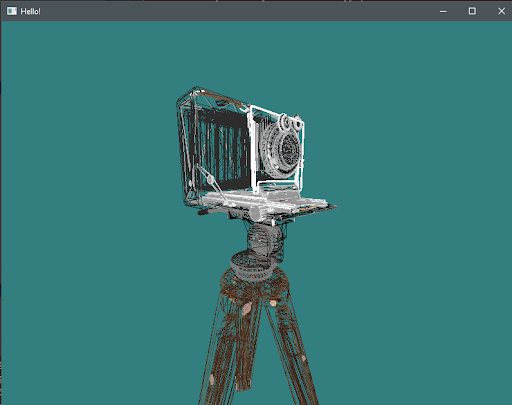

# Go opengl render for gltf files

## Summary 
This project is more of a learning experience than a practical end 
product, but it is designed to render a gltf (file used to store graphics data)
file to a window.

### Basic Info
 - Set the file that is to be opened as the first program argument
 - Move the camera with W,A,S,D (Forward, Left, Down, Right)
 - Move mouse to “look around”
 - Hold Right Shift to increase movement speed
 - Scroll mouse to zoom in or out
 - Hold R to view wired Frame 

## Example Usage 

### Camera 

### Camera (wire-frame)

Models downloaded from Khronos Group's [glTF Sample Models Repo](https://github.com/KhronosGroup/glTF-Sample-Models)